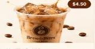

# ☕ Brew & Bites — Full-Stack Artisanal Café & Ordering Platform

<div align="center">



**A high-performance, full-stack artisanal café web application engineered with modern glassmorphism aesthetics, scroll-driven canvas animations, dynamic multi-currency pricing, Supabase authentication & relational data layer, live order management, in-app notifications, and store owner administration.**

[](https://opensource.org/licenses/MIT)
[](https://tailwindcss.com/)
[](https://supabase.com/)
[](https://vercel.com/)

[**Live Demo**](http://localhost:8000) • [**Explore Menu**](#-product-catalog--menu-architecture) • [**Admin Dashboard**](#-store-owner-admin-dashboard) • [**Getting Started**](#-getting-started)

</div>

---

## 🌟 Overview

**Brew & Bites** is a full-stack digital storefront and customer ordering ecosystem built for modern specialty coffee roasters and artisan bakeries. Designed with warm earth tones, glassmorphism layers, and responsive UI components, the platform delivers a seamless end-to-end journey from browsing commercial 4K café photography to real-time checkout and product reviews.

---

## ✨ Core Features & Functionality

### 1. 🎞️ Frame-by-Frame Scroll Canvas Animation
- Smooth scrubbing across **222 high-definition frames** synchronized to page scroll velocity.
- Two-column hero layout with left-aligned typographic callouts and right-aligned glass frame viewport.
- Mobile-optimized canvas rendering with hardware-accelerated paint cycles.

### 2. 🛍️ Dynamic Product Catalog (18 Commercial Café Items)
- **18 handcrafted items** categorized into exactly 3 categories with 6 products each.
- **Product Details Modal**: Displays rich ingredient lists, live price conversion, high-resolution imagery, and average rating breakdown.
- **In-Card Quick Stepper Controls**: Seamlessly transitions from `+` (Add to Order) to an interactive inline pill `[ - ] [ qty ] [ + ]` linked directly to global cart state.

### 3. 🛒 Cart & Multi-Currency Engine
- **Single Source of Truth**: Unified cart state persisted in `localStorage` and synchronized across cards, details modals, cart drawer, and checkout.
- **Real-Time Currency Switching**: Live exchange rate engine supporting **INR (₹)**, **USD ($)**, **CAD (C$)**, and **GBP (£)** across all menu items, modals, drawer totals, historical receipts, and checkout fees.

### 4. 💳 End-to-End Checkout & Payment Simulator
- **Guest Protection & Auth Guard**: Prompts customer authentication before finalizing orders.
- **Dynamic Fulfillment**: Select between In-Store Pickup (Free) or Local Delivery with saved address selection.
- **Payment Gateway Simulation**: Choose between Cash on Delivery (COD) or Online Card Payment with test decline/success simulations.
- **Order Confirmation Receipt**: Generates verified order references (`#BB-XXXX`) and transaction identifiers (`TXN-BB-XXXX`).

### 5. 🔔 In-App Customer & Admin Notification System
- Event-driven notifications dispatched on order placement, status updates (`Placed` $\rightarrow$ `Preparing` $\rightarrow$ `Ready` $\rightarrow$ `Delivered`), and cancellations.
- Supabase Realtime channel subscriptions with unread count badges and slide-out communication panel.
- Styled floating toast banners (`showInAppToast`) replacing all native browser dialogs.

### 6. 👤 Customer Profile, Address Book & Order History
- **Authentication**: Email/Password Sign In & Sign Up powered by Supabase Auth.
- **Address Book**: Multi-address management (Home, Work, Other) with default selection.
- **Order History**: Comprehensive past orders feed with items breakdown, line totals, status badges, 1-click reorder action, and **"Review Product"** triggers.

### 7. 🛡️ Store Owner Admin Dashboard
- **Access Guard**: Protected by Postgres Row Level Security (RLS) and role checks (`isUserAdmin()`).
- **Revenue Analytics**: Interactive SVG daily revenue trend graphs, peak calculations, and payment distribution metrics.
- **Order Lifecycle Management**: Real-time status advancement with customer notification dispatches.
- **Catalog Management**: View and filter all 18 catalog products, toggle live availability ("Mark Sold Out" / "Mark Available"), edit pricing and metadata, or add new products.
- **Reviews Moderation**: Inspect all customer reviews with HTML-sanitized fields (`escapeHtml`) and 1-click deletion.
- **1-Click CSV Export**: Instant download of all orders, customer details, line items, and payment transactions.

---

## 🍽️ Product Catalog & Menu Architecture

The menu is organized into **3 distinct categories with 6 items each (18 total)**:

```
Brew & Bites Menu
├── ☕ Coffee & Cold Brews (6)
│   ├── Classic Cold Brew ($4.50)
│   ├── Vanilla Cold Brew ($5.25)
│   ├── Caramel Cloud ($5.50)
│   ├── Mocha Chill ($5.50)
│   ├── Hazelnut Cold Brew ($5.25)
│   └── Iced Spanish Latte ($5.75)
│
├── 🥐 Savory Bites (6)
│   ├── Cheese Croissant ($4.25)
│   ├── Garlic Herb Croissant ($4.50)
│   ├── Veggie Cream Cheese Bagel ($4.95)
│   ├── Grilled Cheese Sandwich ($6.25)
│   ├── Herb & Cheese Toast ($5.75)
│   └── Loaded Veggie Toast ($5.50)
│
└── 🍪 Sweet Bites (6)
    ├── Choco-Chunk Cookie ($3.75)
    ├── Double Chocolate Muffin ($4.25)
    ├── Blueberry Muffin ($4.25)
    ├── Cinnamon Roll ($4.75)
    ├── Almond Croissant ($4.95)
    └── Fudge Brownie ($4.50)
```

---

## 📂 Project Directory Structure

```plaintext
Brew-Bites-Website/
├── assets/
│   ├── frames/                 # 222 animation frame assets (ezgif-frame-001.jpg -> 222.jpg)
│   ├── images/                 # Commercial 4K product photography for all 18 menu items
│   └── hero.png                # Brand graphics & visual identity assets
│
├── css/
│   └── style.css               # Design system tokens, color palettes, and custom utilities
│
├── js/
│   ├── supabase.js             # Supabase client bootstrap & recovery token handler
│   ├── country-config.js       # Phone validation patterns and regional currency settings
│   ├── currency.js             # Exchange rate calculator and multi-currency formatter
│   ├── products.js             # Authoritative 18-product catalog & database synchronization
│   ├── reviews.js              # Reviews data layer, rating calculations & modal views
│   ├── cart.js                 # Cart state, item steppers, and slide-out drawer controller
│   ├── addresses.js            # Customer address book management & database persistence
│   ├── orders.js               # Multi-tier order placement pipeline, RPC & fallback logic
│   ├── notifications.js        # Notification center, Realtime listeners & toast banners
│   ├── checkout.js             # Checkout form validation, order review & confirmation receipt
│   ├── profile.js              # Auth modals, customer details, and order history view
│   ├── admin.js                # Enterprise admin dashboard, revenue charts & moderation
│   └── main.js                 # App initialization, product grid rendering & modal triggers
│
├── sql/                        # Database migrations, RLS policies, and Postgres RPC functions
│   ├── phase1_schema.sql
│   ├── phase5_admin_roles_migration.sql
│   ├── phase8_payments_migration.sql
│   ├── phase12_reviews_migration.sql
│   └── phase16_seed_expanded_catalog.sql
│
├── index.html                  # Main storefront, hero animation canvas, and menu showcase
├── reviews.html                # Dedicated customer reviews & ratings page
├── roastery.html               # Artisanal roastery story and brewing process page
├── vercel.json                 # Vercel deployment and routing configuration
├── package.json                # Project dependencies & scripts
└── README.md                   # Project documentation
```

---

## 🚀 Getting Started

### Prerequisites
- Any modern web browser (Google Chrome, Firefox, Edge, Safari).
- Python 3.x, Node.js, or any static HTTP web server.

### Local Development Server

1. **Clone the repository**:
   ```bash
   git clone https://github.com/Lakshpreetkaur/Brew-Bites-Website.git
   cd Brew-Bites-Website
   ```

2. **Start the local development server**:
   - **Using Python 3**:
     ```bash
     python -m http.server 8000
     ```
   - **Using Node / NPX**:
     ```bash
     npx serve .
     ```

3. **Open in your browser**:
   - **Home & Menu**: [http://localhost:8000](http://localhost:8000)
   - **Reviews Page**: [http://localhost:8000/reviews.html](http://localhost:8000/reviews.html)
   - **Our Roastery**: [http://localhost:8000/roastery.html](http://localhost:8000/roastery.html)

---

## 🔐 Database & Backend Architecture (Supabase)

The backend is architected on **PostgreSQL** hosted on **Supabase** with Row-Level Security (RLS):

- **`profiles`**: Stores user roles (`customer`, `admin`), contact numbers, and timestamps.
- **`products`**: Centralized catalog storing canonical IDs, pricing, categories, and availability flags.
- **`orders`**: Customer orders with references (`#BB-XXXX`), fulfillment types, and status tracking.
- **`order_items`**: Relational line items linking products, quantities, and historical unit prices.
- **`payments`**: Payment records storing methods (`online`, `cash_on_delivery`), statuses, and transaction references.
- **`addresses`**: User-scoped delivery addresses with default selection flags.
- **`reviews`**: Product ratings (1–5 stars), customer reviews, and verified purchase flags with HTML sanitization.
- **`notifications`**: Targeted user and admin notifications with Supabase Realtime listeners.

---

## ☁️ Deployment (Vercel)

1. Push your repository to GitHub.
2. Connect your GitHub repository to [Vercel](https://vercel.com).
3. Set Framework Preset to **Other** (Root directory: `./`).
4. Click **Deploy** — your café storefront is live with zero-configuration!

---

## 📄 License

This project is licensed under the **MIT License** — see the [LICENSE](LICENSE) file for details.

---

<div align="center">
  <sub>Handcrafted with ☕ and passion for exceptional coffee experiences.</sub>
</div>
